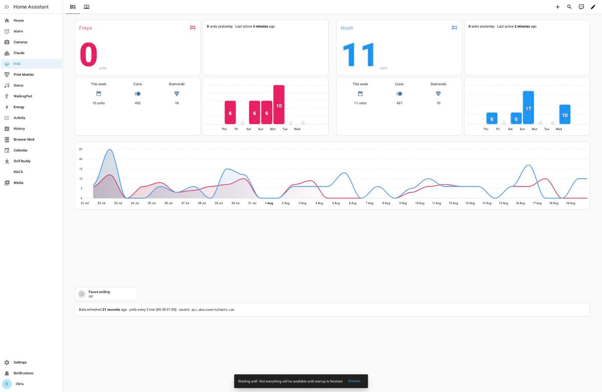

# Abacus Mental Math — Home Assistant Custom Integration (Unofficial)

[](https://github.com/hacs/integration)
[](LICENSE)

**This is an unofficial, community integration.** It is not built, endorsed, or
supported by Abacus Mental Math. It talks to a private API the official
mobile app uses; there is no public developer program, and endpoints may
change without notice.

Track your children's [Abacus Mental Math](https://abacusmentalmath.com/)
progress in Home Assistant: log in once with your **parent account**, and
every child under that account is discovered and tracked automatically —
no per-child setup, no hard-coded student IDs.



*A real dashboard built from this data (units, coins, diamonds, and a rolling
history chart per child) — yours will differ since entity IDs come from your
own account's children.*

## What it gives you

Log in with your parent email + password, and the integration discovers
every child on the account and creates one device per child with these
sensors:

- **Units today** / **yesterday** / **this week** / **this month** — abacus
  exercises completed
- **Coins**, **Diamonds** — in-app currency balances
- **Last active** — timestamp of the child's last app session
- **Wins today / this week / this month** — diagnostic sensors, disabled by
  default (enable per-entity if you want them)

New children added to the parent account later are picked up automatically
on the next poll — nothing to reconfigure.

## Installation

### HACS (custom repository)

1. HACS → Integrations → ⋮ → Custom repositories
2. Add `https://github.com/chrisns/ha-abacusmentalmath`, category **Integration**
3. Install **Abacus Mental Math**
4. Restart Home Assistant
5. Settings → Devices & Services → Add Integration → search **Abacus Mental Math**
6. Enter your parent account email and password

### Manual

Copy `custom_components/abacusmentalmath/` into your HA `/config/custom_components/`.
Restart HA. Add the integration via the UI.

## Configuration

Everything is set up through the UI — no YAML.

- **Setup**: parent email + password. Children are discovered automatically.
- **Options** (⚙ on the integration card): poll interval, 5 minutes to 6 hours
  (default 15 minutes).
- If your password changes, Home Assistant will prompt you to re-authenticate
  rather than silently failing.

## Known limitations

- **No next-lesson calendar (yet).** The mobile app shows each child's
  scheduled class (Zoom link, day/time) via a `/profile/broadcasts`
  endpoint, but that endpoint requires a *child*-scoped login token — the
  parent-account token this integration uses gets a clean `401` from it.
  Tracked in [#1](https://github.com/chrisns/ha-abacusmentalmath/issues/1);
  it needs a captured trace of the token-exchange call the app makes when a
  parent opens a child's profile. Contributions welcome.
- **Undocumented API.** Every endpoint here was found by testing against a
  real account, not from published docs. If Abacus Mental Math changes their
  backend, this breaks until someone re-discovers the new shape.
- **No "pause polling" toggle.** Disable the integration (or individual
  entities) from Settings → Devices & Services instead — Home Assistant's
  built-in mechanism already covers this.

## How it works

1. `POST /parent/login` with email + password → bearer token (re-fetched
   automatically on expiry or a `401`).
2. `GET /parent/students` → every child on the account.
3. Per child: `GET /parent/{id}/profile` (coins, diamonds, last active, wins)
   and `GET /parent/{id}/profile/units-finished/{day,week,month}/{offset}`
   (units completed, summed from the day-by-day breakdown the API returns).

All of this — and the plan for the calendar entity — was reverse-engineered
with the account owner's permission; it is not a documented, stable API.

## Testing

```sh
pip install -r requirements_test.txt
pytest tests/
```

`tests/test_api.py` and `tests/test_login_race.py` also run standalone with
just `python3 tests/<file>.py` — no pytest, no Home Assistant install, only
`aiohttp` (already a dependency). `tests/test_config_flow.py` and
`tests/test_integration.py` use Home Assistant's own test harness
(`pytest-homeassistant-custom-component`) with the network layer mocked, so
no real account or network access is needed to run any of it.

## Contributing

Issues and PRs welcome, especially anyone able to capture the child-token
exchange the app uses for `/profile/broadcasts` (see
[Known limitations](#known-limitations)) — that's the one piece needed to
finish the next-lesson calendar entity.
